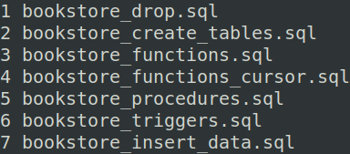

# Book Store Database Setup

## Overview
- **bookstore_drop.sql**: Reset the database, dropping all tables and data.
- **bookstore_create_tables.sql**: Set up the database and populate it with sample data.
- **bookstore_functions.sql**: Set up all normal func.
- **bookstore_functions_cursor.sql**: Set up cursor func.
- **bookstore_procedures.sql**: Set up all trigger.
- **bookstore_triggers.sql**: Set up all trigger.
- **bookstore_insert_data.sql**: Insert sample data for testing

## FILE RUNNING ORDER:

  

## DB OVERVIEW:

  

