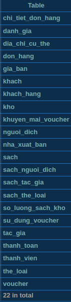

# Book Store Database Setup
## Overview
- **bookstore_drop.sql**: Reset the database, dropping all tables and data.
- **bookstore_create_tables.sql**: Set up the database and populate it with sample data.
- **bookstore_functions.sql**: Set up all normal func.
- **bookstore_procedures.sql**: Set up all trigger.
- **bookstore_triggers.sql**: Set up all trigger.
- **bookstore_insert_data.sql**: Insert sample data for testing

## FILE RUNNING ORDER:

**the same as overview order**

## DB OVERVIEW:
<p style="margin-left: 40px;">
  
</p>

## FOR BOTH FRONTEND AND BACKEND:
- 1/ YOU MUST CREATE DB FIRST, MEAN DO AS ABOVE (OR IF WANT FAST TEST CAN DO **create_tables** and
**insert_data** ONLY).

- 2/ for sql server management studio user, MUST open TCP connection for backend to connect.
<p style="margin-left: 40px;">
  
</p>

- 3/ dev backend and frontend as guided in how_to_run.txt in both backend and frontend folder.

# APIS FOR WEB

**Base URL:** `http://localhost:4444`

---

### Important Notes

1.  **Book IDs Jumping (1 -> 1000):**
    * This is **not a bug**. It is SQL Server's "Identity Caching".
    * *Fix:* Run `ALTER DATABASE SCOPED CONFIGURATION SET IDENTITY_CACHE = OFF;` if it annoys you. Otherwise, ignore it.

2.  **NULL Handling:**
    * The database allows NULLs, but this API returns "Sentinel Values" instead of null.
    * **Integer fields** (e.g., `nam_xuat_ban`): Returns `-1`.
    * **String fields** (e.g., `mo_ta`): Returns `"-1"`.
    * **Float fields** (e.g., `trong_luong`): Returns `-1`.

3.  **JSON Rules:**
    * **Strict Types:** Do not quote numbers.
    * Right: `"gia_ban": 100000`
    * Wrong: `"gia_ban": "100000"` (Will cause 400 Bad Request).

[!] RULES FOR FRONTEND DEV:
1.  **PRICES (READ):** Prices are "Cached" in the Book object (`gia_hien_tai`). 
    Always trust this field. Do not try to calculate price from history or joins.

2.  **PRICES (WRITE):** You CANNOT update price via `/update_book_info`. 
    The backend will ignore it. You MUST use `/change_book_price`.

3.  **DELETE:** Deleting is a "Soft Delete" (`da_xoa = 1`).
    * The book vanishes from the main list.
    * Old orders still link to it safely.
    * You can still fetch it via ID, but `da_xoa` will be `true`.
---

### OVERVIEW
```txt
for admin token get it in terminal, will change every 5 min

--- BOOKS & SEARCH ---
GET  /get_all_books                          [OPEN]
GET  /get_book_by_id?id={id}                 [OPEN]
GET  /search_books?name={x}...               [OPEN]
GET  /get_books_by_author?id={id}            [OPEN]
GET  /get_books_by_category?id={id}          [OPEN]
GET  /get_nxb_by_id?id={id}                  [OPEN]
GET  /get_price_by_id?id={id}                [OPEN]

--- ADMIN MANAGEMENT ---
POST /add_new_book                           [ADMIN]
POST /update_book_info?id={id}               [ADMIN]
POST /change_book_price?id={id}              [ADMIN]
POST /delete_book?id={id}                    [ADMIN]
GET  /admin/get_all_orders                   [ADMIN]
POST /admin/restock_book                     [ADMIN]
POST /update_order_status                    [ADMIN]

--- USER: PROFILE & ADDRESS ---
POST /register_member                        [OPEN]
POST /login_member                           [OPEN]
GET  /get_member_info                        [AUTH]
POST /add_address                            [AUTH]
GET  /get_my_addresses                       [AUTH]

--- USER: SHOPPING FLOW ---
POST /add_to_cart                            [OPEN] (Uses customer_id in JSON)
POST /remove_from_cart                       [OPEN] (Uses customer_id in JSON)
POST /update_cart_qty                        [OPEN] (Uses customer_id in JSON)
GET  /get_current_cart?id={uid}              [OPEN]
POST /set_shipping_address                   [AUTH] (Strict Token Check)
POST /set_payment_method                     [OPEN]
GET  /get_last_payment_method                [AUTH]
POST /apply_voucher                          [OPEN]
GET  /get_my_vouchers                        [AUTH]
GET  /find_best_voucher                      [AUTH]
POST /checkout                               [OPEN] (Uses cart_id in JSON)
POST /cancel_order                           [AUTH] (Strict Token Check)

--- HISTORY & RATINGS ---
GET  /get_order_history?id={uid}             [OPEN]
GET  /get_order_detail?id={oid}              [OPEN]
POST /add_rating                             [AUTH]
GET  /get_ratings_by_book?id={id}            [OPEN]
GET  /get_rating_by_id?id={id}               [OPEN]
```

### DETAILS
```txt
================================================================================
1. PUBLIC READ (BOOKS & SEARCH)
================================================================================
/////////////////////
[GET] /get_all_books
/////////////////////
Logic: Returns list of non-deleted books.
Response:
[
  { "ma_sach": 1, "ten_sach": "A", "nam_xuat_ban": 2020, "so_trang": 100, "gia_hien_tai": 50000 }
]

////////////////////////////////
[GET] /get_book_by_id?id={id}
////////////////////////////////
Logic: Returns full details via `fn_LayChiTietSach`.
Response:
{
  "ma_sach": 1, "ten_sach": "A", "gia_hien_tai": 50000, "so_sao_trung_binh": 4.5,
  "ten_nguoi_dich": "B", "mo_ta": "...", "hinh_thuc": "Soft", "so_trang": 100,
  "nam_xuat_ban": 2020, "ngay_phat_hanh": "2020-01-01", "ten_nxb": "NXB Kim Dong",
  "danh_sach_tac_gia": "Nam Cao", "danh_sach_the_loai": "Novel"
}

///////////////////////////////////////////////////////
[GET] /search_books?name={x}&author={y}&type={z}
///////////////////////////////////////////////////////
Logic: Advanced search. `name` is required. `author` and `type` are optional.
Response:
[
  { "ma_sach": 1, "ten_sach": "A", "gia_hien_tai": 50000, "hinh_thuc": "Soft", "nam_xuat_ban": 2020 }
]

////////////////////////////////
[GET] /get_books_by_author?id={id}
////////////////////////////////
Logic: Lists books by specific author ID. Same format as get_all_books.

////////////////////////////////
[GET] /get_books_by_category?id={id}
////////////////////////////////
Logic: Lists books by specific category ID. Same format as get_all_books.

////////////////////////////////
[GET] /get_nxb_by_id?id={id}
////////////////////////////////
Logic: Publisher details.
Response: { "ma_nxb": 1, "ten_nxb": "Kim Dong", "email": "...", "dia_chi": "...", "sdt": "..." }

////////////////////////////////
[GET] /get_price_by_id?id={id}
////////////////////////////////
Logic: View specific price history record.
Response: { "ma_gia": 10, "ma_sach": 1, "gia": 50000, "ngay_ap_dung": "2025-01-01 10:00:00" }

================================================================================
2. ADMIN OPERATIONS
   * Requires Header: Authorization: Bearer <AdminToken>
================================================================================
/////////////////////
[POST] /add_new_book
/////////////////////
Logic: Inserts Book + Price + Inventory.
Input:
{
  "ten_sach": "New Book", "nam_xuat_ban": 2025, "ma_nxb": 1, "so_trang": 200,
  "ngon_ngu": "VN", "trong_luong": 300.5, "do_tuoi": 16, "hinh_thuc": "Hard",
  "mo_ta": "...", "gia_ban": 100000, "ten_nguoi_dich": "Mr. A"
}

////////////////////////////////
[POST] /update_book_info?id={id}
////////////////////////////////
Logic: Updates Book metadata.
Input: { "ten_sach": "New Name", "nam_xuat_ban": 2024, ... } (Send all fields)

////////////////////////////////
[POST] /change_book_price?id={id}
////////////////////////////////
Logic: Updates price table.
Input: { "gia_moi": 120000 }

////////////////////////////////
[POST] /delete_book?id={id}
////////////////////////////////
Logic: Soft delete (da_xoa = 1).
Input: {}

///////////////////////////
[GET] /admin/get_all_orders
///////////////////////////
Logic: View all 'placed' orders for processing.
Response:
[
  { "ma_don": 99, "khach_hang": "a@a.com", "ngay_dat": "...", "tong_tien": 500000, "trang_thai": "Processing", "dia_chi": "VN" }
]

///////////////////////////
[POST] /admin/restock_book
///////////////////////////
Logic: Adds stock to warehouse.
Input: { "ma_sach": 1, "ma_kho": 1, "so_luong_them": 50 }

///////////////////////////
[POST] /update_order_status
///////////////////////////
Logic: Sets order to Delivered.
Input: { "ma_don": 99, "status": "Delivered" }

================================================================================
3. AUTH & USER DATA
================================================================================
///////////////////////
[POST] /register_member
///////////////////////
Logic: Register new user.
Input:
{
  "ho": "Nguyen", "ho_ten_dem": "Van", "email": "a@a.com", "sdt": "0909...",
  "ten_dang_nhap": "user1", "mat_khau": "pass", "gioi_tinh": "Nam", "ngay_sinh": "2000-01-01"
}

////////////////////
[POST] /login_member
////////////////////
Logic: Returns Bearer Token.
Input: { "ten_dang_nhap": "user1", "mat_khau": "pass" }
Response: { "token": "..." }

/////////////////////
[GET] /get_member_info
/////////////////////
Logic: Returns profile of logged-in user. Header Token required.

////////////////////
[POST] /add_address
////////////////////
Logic: Adds new shipping address. Header Token required.
Input: { "thanh_pho": "HCM", "quan_huyen": "Q1", "phuong_xa": "Dakao", "dia_chi_nha": "123 Street" }

///////////////////////
[GET] /get_my_addresses
///////////////////////
Logic: List all addresses for logged-in user. Header Token required.

================================================================================
4. CART & ORDER FLOW
================================================================================
////////////////////
[POST] /add_to_cart
////////////////////
Logic: Add item.
Input: { "ma_khach_hang": 1, "ma_sach": 10, "so_luong": 1 }

/////////////////////////
[POST] /remove_from_cart
/////////////////////////
Logic: Remove item.
Input: { "ma_khach_hang": 1, "ma_sach": 10 }

////////////////////////
[POST] /update_cart_qty
////////////////////////
Logic: Change quantity.
Input: { "ma_khach_hang": 1, "ma_sach": 10, "so_luong": 5 }

///////////////////////////////////
[GET] /get_current_cart?id={user_id}
///////////////////////////////////
Logic: Returns Cart + Items + Live Stock/Price Warnings.
Response:
{
  "header": { "ma_don": 100, ... },
  "items": [ ... ],
  "warnings": [ "[LOW_STOCK] Book A: Warehouse has 0 left" ]
}

/////////////////////////////
[POST] /set_shipping_address
/////////////////////////////
Logic: Link address to cart. Header Token required.
Input: { "ma_dia_chi": 5 }

///////////////////////////
[POST] /set_payment_method
///////////////////////////
Logic: Set 'Visa' or 'Shipper'.
Input: { "ma_khach_hang": 1, "hinh_thuc": "Visa" }

//////////////////////////////
[GET] /get_last_payment_method
//////////////////////////////
Logic: Get last used method. Header Token required.

//////////////////////
[POST] /apply_voucher
//////////////////////
Logic: Apply code.
Input: { "ma_khach_hang": 1, "ma_code": "SALE" }

///////////////////////
[GET] /get_my_vouchers
///////////////////////
Logic: Get owned vouchers. Header Token required.

////////////////////////
[GET] /find_best_voucher
////////////////////////
Logic: Auto-find best code. Header Token required.

/////////////////
[POST] /checkout
/////////////////
Logic: Validates Address & Payment exist. Checks Stock. Commits order.
Input: { "cart_id": 100 }

/////////////////////
[POST] /cancel_order
/////////////////////
Logic: Cancel if not shipped. Header Token required.
Input: { "ma_don": 100 }

================================================================================
5. HISTORY & RATINGS
================================================================================
////////////////////////////////////
[GET] /get_order_history?id={user_id}
////////////////////////////////////
Logic: List past orders.

////////////////////////////////////
[GET] /get_order_detail?id={order_id}
////////////////////////////////////
Logic: List items in past order.

/////////////////
[POST] /add_rating
/////////////////
Logic: Review a book. Header Token required.
Input: { "ma_sach": 1, "so_sao": 5, "noi_dung": "Great" }

////////////////////////////////
[GET] /get_ratings_by_book?id={id}
////////////////////////////////
Logic: List reviews.

//////////////////////////////
[GET] /get_rating_by_id?id={id}
//////////////////////////////
Logic: Get single review.
```
